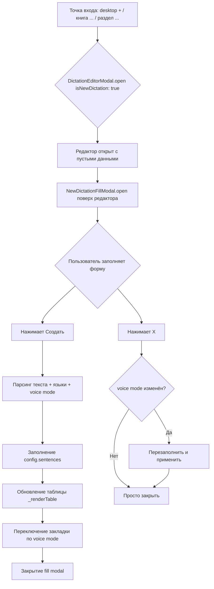
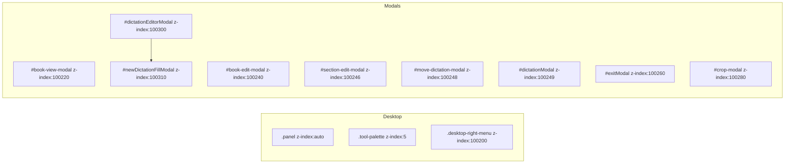

# План: Создание нового диктанта через модальное окно редактора

## Обзор

Три связанные задачи:
1. **Desktop layout** — переместить tool palette в угол, убрать лишние отступы desk-zone
2. **Три точки входа** для создания нового диктанта через `DictationEditorModal` (вместо `/dictation_editor/new`)
3. **Модальное окно начального заполнения** (`#newDictationFillModal`) — внутри существующих файлов редактора

**Ключевое решение:** Весь код fill modal живёт внутри существующих файлов редактора:
- HTML: `templates/partials/dictation_editor_modal.html`
- CSS: `static/css/dictation_editor_modal.css`
- JS: `static/js/dictation_editor_modal.js`

---

## Часть 1: Desktop layout

### Текущее состояние

- `.tool-palette--desk` — `position: absolute; top: 18px; left: 18px; z-index: 5;` внутри `.desk-zone`
- `.desk-zone` — `padding: 16px;`
- `.desk-cards-container` — `padding-left: 96px;` (чтобы не перекрывать палитру)
- `.page-index .panel` — `padding-left: clamp(16px, 3vw, 20px); padding-right: ...`
- `.desktop-stats-panel + .tool-palette--desk` — `top: 200px;`

### Цель

- Палитра инструментов — в самый угол (top: 0, right: 0 или left: 0)
- Desk-zone — без лишних отступов, занимает всё доступное пространство (кроме хедера, левой панели управления, нижней информационной панели)

### Файл для изменения

**`static/css/desktop.css`**:
- `.tool-palette--desk`: `position: absolute; top: 0; right: 0;` — убрать `left: 18px; top: 18px;`
- `.desk-zone`: убрать `padding: 16px;` → `padding: 0;`
- `.desk-cards-container`: убрать `padding-left: 96px;` (палитра больше не слева)
- `.page-index .panel`: убрать `padding-left/padding-right` или уменьшить до 0
- `.desktop-stats-panel + .tool-palette--desk`: убрать (больше не актуально)

---

## Часть 2: Три точки входа для создания диктанта

### 2a: Кнопка "+" на левой панели desktop

**Файл:** `static/js/desktop.js`

В `initToolPalette()` (строка 614) или `stubAction()` (строка 369) добавить обработку `desktop-new`:

```javascript
if (action === 'desktop-new') {
  if (window.DictationEditorModal && typeof window.DictationEditorModal.open === 'function') {
    window.DictationEditorModal.open({
      isNewDictation: true,
      dictationId: '',
      originalLanguage: '',
      translationLanguage: '',
      title: '',
      level: '',
      coverUrl: '',
      sentences: [],
      audio_user_shared: null,
      audio_order: '',
    });
  }
  return;
}
```

### 2b: Кнопка "Добавить диктант" в меню "..." книги

**Файл:** `static/js/book_modal.js`

В `renderActiveBookCard()`, обработчик `add-dictation` (строка 1257-1264):

**Было:**
```javascript
if (action === 'add-dictation') {
  try {
    const id = (book && book.id != null) ? Number(book.id) : state.bookViewActiveBookId;
    if (id) setDictationTargetBook(id);
  } catch (e2) {}
  window.location.href = '/dictation_editor/new';
  return;
}
```

**Стало:**
```javascript
if (action === 'add-dictation') {
  try {
    const id = (book && book.id != null) ? Number(book.id) : state.bookViewActiveBookId;
    if (id) setDictationTargetBook(id);
  } catch (e2) {}
  // Открыть редактор для нового диктанта
  if (window.DictationEditorModal && typeof window.DictationEditorModal.open === 'function') {
    window.DictationEditorModal.open({ isNewDictation: true, ... });
  }
  return;
}
```

### 2c: Восстановить меню "..." для разделов в book modal

**Файл:** `static/js/book_modal.js`

В `buildSectionNode()` (строка 1337-1369) добавить кнопку "..." (dropdown-menu) в `.structure-item-header` с тремя пунктами:
- **Нова група** (новая подгруппа в текущей группе) — вызывает `openSectionModal(null, sectionId)`
- **Новий диктант** — вызывает `DictationEditorModal.open({ isNewDictation: true, ... })` с `setDictationTargetBook(bookId)`
- **Редагувати розділ** — вызывает `openSectionModal(section, parentId)`

Текущий HTML `.structure-item-header`:
```html
<div class="structure-item-header">
  <button class="structure-item-toggle" ...>
    <i data-lucide="chevron-right"></i>
  </button>
  <span class="structure-item-title">...</span>
</div>
```

Новый HTML:
```html
<div class="structure-item-header">
  <button class="structure-item-toggle" ...>
    <i data-lucide="chevron-right"></i>
  </button>
  <span class="structure-item-title">...</span>
  <div class="dropdown-menu-wrapper" style="margin-left: auto;">
    <button class="structure-item-menu-btn" type="button" title="Дії">
      <i data-lucide="more-vertical"></i>
    </button>
    <div class="dropdown-menu section-actions-menu" style="display: none;">
      <button class="dropdown-menu-item" data-action="section-add-group" type="button">
        <i data-lucide="folder-plus"></i> <span>Нова група</span>
      </button>
      <button class="dropdown-menu-item" data-action="section-add-dictation" type="button">
        <i data-lucide="plus"></i> <span>Новий диктант</span>
      </button>
      <button class="dropdown-menu-item" data-action="section-edit" type="button">
        <i data-lucide="edit-3"></i> <span>Редагувати розділ</span>
      </button>
    </div>
  </div>
</div>
```

Обработчики кликов добавить после вставки в DOM (в цикле после `buildSectionNode` или через делегирование).

---

## Часть 3: Fill modal HTML

**Файл:** `templates/partials/dictation_editor_modal.html`

Добавить в конец файла (перед закрывающим `</div>` редактора или после него):

```html
<!-- new-dictation-fill-modal: начальное заполнение нового диктанта -->
<div id="newDictationFillModal" class="modal-overlay" style="display:none;">
  <div class="modal-content new-dictation-fill-modal__content">
    <!-- Row 1: Header -->
    <div class="new-dictation-fill-modal__header">
      <div class="new-dictation-fill-modal__header-left">
        <span class="new-dictation-fill-modal__id-label">ID: <span id="newDictationFillId">новий</span></span>
        <input type="text" id="newDictationFillTitle" placeholder="Назва диктанту...">
      </div>
      <div class="new-dictation-fill-modal__header-actions">
        <button type="button" id="newDictationFillCreateBtn" class="btn btn-primary">Створити диктант</button>
        <button type="button" id="newDictationFillCloseBtn" class="btn-close" title="Закрити">
          <i data-lucide="x"></i>
        </button>
      </div>
    </div>

    <!-- Row 2: Two-panel layout -->
    <div class="new-dictation-fill-modal__two-panels">
      <!-- Left panel: Language flags + translation prefix -->
      <div class="new-dictation-fill-modal__left-panel">
        <div id="newDictationFillLangPair"></div>
        <div class="new-dictation-fill-modal__delimiter-row">
          <label for="newDictationFillDelimiter">Префікс перекладу:</label>
          <input type="text" id="newDictationFillDelimiter" value="//" placeholder="//">
        </div>
      </div>
      <!-- Right panel: Voice mode -->
      <div class="new-dictation-fill-modal__right-panel">
        <label>Режим озвучки:</label>
        <div class="new-dictation-fill-modal__voice-modes">
          <label class="radio-label">
            <input type="radio" name="newDictationVoiceMode" value="auto" checked> Авто
          </label>
          <label class="radio-label">
            <input type="radio" name="newDictationVoiceMode" value="file"> Є файл
          </label>
          <label class="radio-label">
            <input type="radio" name="newDictationVoiceMode" value="self"> Запишу сам
          </label>
        </div>
      </div>
    </div>

    <!-- Row 4: Text input -->
    <div class="new-dictation-fill-modal__text-section">
      <label for="newDictationFillText">Текст диктанту:</label>
      <div id="newDictationFillText"
           class="new-dictation-fill-modal__text-editor"
           contenteditable="true"
           data-placeholder="Введіть текст диктанту..."></div>
    </div>
  </div>
</div>
```

---

## Часть 4: Fill modal CSS

**Файл:** `static/css/dictation_editor_modal.css`

Добавить стили для `#newDictationFillModal`:

```css
/* ===== New Dictation Fill Modal ===== */
#newDictationFillModal {
  z-index: 100310;
  /* наследует .modal-overlay */
}

#newDictationFillModal .new-dictation-fill-modal__content {
  width: min(90vw, 800px);
  max-height: 85vh;
  display: flex;
  flex-direction: column;
  gap: 12px;
  padding: 20px;
  background: var(--color-panel-bg, #fff);
  border-radius: 16px;
  box-shadow: 0 20px 60px rgba(0,0,0,0.3);
}

/* Row 1: Header */
.new-dictation-fill-modal__header {
  display: flex;
  align-items: center;
  justify-content: space-between;
  gap: 12px;
}

.new-dictation-fill-modal__header-left {
  display: flex;
  align-items: center;
  gap: 12px;
  flex: 1;
}

.new-dictation-fill-modal__id-label {
  font-size: 13px;
  color: var(--color-text-secondary, #6b7280);
  white-space: nowrap;
}

#newDictationFillTitle {
  flex: 1;
  padding: 8px 12px;
  border: 1px solid var(--color-border, #dee2e6);
  border-radius: 8px;
  font-size: 15px;
  background: var(--color-bg, #fff);
  color: var(--color-text, #1f2933);
}

.new-dictation-fill-modal__header-actions {
  display: flex;
  align-items: center;
  gap: 8px;
}

/* Row 2: Two panels */
.new-dictation-fill-modal__two-panels {
  display: flex;
  gap: 16px;
  align-items: flex-start;
}

.new-dictation-fill-modal__left-panel {
  flex: 1;
  display: flex;
  flex-direction: column;
  gap: 8px;
}

.new-dictation-fill-modal__right-panel {
  flex: 0 0 auto;
  min-width: 180px;
  display: flex;
  flex-direction: column;
  gap: 6px;
}

.new-dictation-fill-modal__right-panel > label {
  font-size: 13px;
  font-weight: 600;
  color: var(--color-text, #1f2933);
}

.new-dictation-fill-modal__voice-modes {
  display: flex;
  flex-direction: column;
  gap: 4px;
}

.new-dictation-fill-modal__voice-modes .radio-label {
  display: flex;
  align-items: center;
  gap: 6px;
  font-size: 14px;
  cursor: pointer;
  padding: 4px 0;
}

/* Delimiter row */
.new-dictation-fill-modal__delimiter-row {
  display: flex;
  align-items: center;
  gap: 8px;
}

.new-dictation-fill-modal__delimiter-row label {
  font-size: 13px;
  color: var(--color-text-secondary, #6b7280);
  white-space: nowrap;
}

#newDictationFillDelimiter {
  width: 60px;
  padding: 4px 8px;
  border: 1px solid var(--color-border, #dee2e6);
  border-radius: 6px;
  font-size: 14px;
  text-align: center;
}

/* Row 4: Text editor */
.new-dictation-fill-modal__text-section {
  flex: 1;
  display: flex;
  flex-direction: column;
  min-height: 0;
}

.new-dictation-fill-modal__text-section > label {
  font-size: 13px;
  font-weight: 600;
  margin-bottom: 4px;
  color: var(--color-text, #1f2933);
}

#newDictationFillText {
  flex: 1;
  min-height: 200px;
  max-height: 400px;
  padding: 12px;
  border: 1px solid var(--color-border, #dee2e6);
  border-radius: 8px;
  font-size: 15px;
  line-height: 1.6;
  overflow-y: auto;
  white-space: pre-wrap;
  word-wrap: break-word;
  background: var(--color-bg, #fff);
  color: var(--color-text, #1f2933);
  outline: none;
}

#newDictationFillText:focus {
  border-color: var(--color-primary, #3b82f6);
  box-shadow: 0 0 0 2px rgba(59,130,246,0.15);
}

#newDictationFillText:empty::before {
  content: attr(data-placeholder);
  color: var(--color-text-tertiary, #9ca3af);
  pointer-events: none;
}

/* Подсветка строк перевода (как в старом редакторе) */
#newDictationFillText .translation-line {
  color: var(--color-translation, #6b7280);
  font-style: italic;
}

#newDictationFillText .original-line {
  color: var(--color-text, #1f2933);
}
```

---

## Часть 5: Fill modal JS

**Файл:** `static/js/dictation_editor_modal.js`

Добавить объект `window.NewDictationFillModal` в конец файла (перед последним блоком или в подходящее место):

```javascript
// ===== NewDictationFillModal =====
window.NewDictationFillModal = {
  _state: {
    isOpen: false,
    voiceMode: 'auto',
    originalVoiceMode: 'auto',
    editorConfig: null,
    _languageSelector: null,
  },

  open(editorConfig) {
    const modal = document.getElementById('newDictationFillModal');
    if (!modal) return;
    this._state.editorConfig = editorConfig;
    this._state.voiceMode = 'auto';
    this._state.originalVoiceMode = 'auto';
    this._state.isOpen = true;

    // Сбросить поля
    document.getElementById('newDictationFillTitle').value = editorConfig.title || '';
    document.getElementById('newDictationFillText').innerHTML = '';
    document.getElementById('newDictationFillDelimiter').value = '//';
    document.querySelector('input[name="newDictationVoiceMode"][value="auto"]').checked = true;

    // Инициализировать LanguageSelector
    this._initLanguageSelector();

    // Инициализировать подсветку текста
    this._setupTextareaHighlighting();

    modal.style.display = 'flex';
    if (window.lucide) lucide.createIcons();
  },

  close() {
    const modal = document.getElementById('newDictationFillModal');
    if (!modal) return;

    // Если voice mode изменён — перезаполнить и применить
    if (this._state.voiceMode !== this._state.originalVoiceMode) {
      this._refillAndApply();
    }

    modal.style.display = 'none';
    this._state.isOpen = false;
  },

  async create() {
    const title = document.getElementById('newDictationFillTitle').value.trim();
    const text = document.getElementById('newDictationFillText').innerText.trim();
    const delimiter = document.getElementById('newDictationFillDelimiter').value || '//';
    const voiceMode = document.querySelector('input[name="newDictationVoiceMode"]:checked')?.value || 'auto';

    if (!text) {
      // Показать тост или подсветить поле
      return;
    }

    const config = this._state.editorConfig;
    if (!config) return;

    // Получить языки из LanguageSelector
    const langPair = this._getSelectedLanguages();
    if (!langPair || !langPair.original) {
      // Тост: выберите язык
      return;
    }

    // Установить заголовок
    if (title) config.title = title;

    // Установить языки
    config.originalLanguage = langPair.original;
    config.translationLanguage = langPair.translation || '';

    // Установить voice mode
    config.audio_order = voiceMode === 'auto' ? 'a' : (voiceMode === 'file' ? 'f' : 'm');

    // Распарсить текст
    // Используем существующую логику из старого createDictationFromStart
    // или упрощённую версию
    const sentences = this._parseText(text, delimiter, langPair.original, langPair.translation);
    config.sentences = sentences;

    // Обновить редактор
    if (window.DictationEditorModal && typeof window.DictationEditorModal._renderTable === 'function') {
      await window.DictationEditorModal._renderTable();
    }

    // Переключить закладку согласно voice mode
    this._switchTabByVoiceMode(voiceMode);

    // Закрыть fill modal
    this.close();
  },

  _parseText(text, delimiter, origLang, trLang) {
    // Упрощённая версия парсинга (как в старом parseInputText)
    const lines = text.split('\n').filter(l => l.trim());
    const sentences = [];
    let keyCounter = 0;

    for (const line of lines) {
      const trimmed = line.trim();
      if (!trimmed) continue;

      const delimIndex = trimmed.indexOf(delimiter);
      let originalText = trimmed;
      let translationText = '';

      if (delimIndex >= 0) {
        originalText = trimmed.substring(0, delimIndex).trim();
        translationText = trimmed.substring(delimIndex + delimiter.length).trim();
      }

      keyCounter++;
      const key = `s_${keyCounter}`;

      const sentence = {
        key,
        original: {
          text: originalText,
          lang: origLang,
          audio: '',
          audio_file: '',
          audio_mic: '',
          start: '',
          end: '',
        },
      };

      if (translationText && trLang) {
        sentence.translation = {
          text: translationText,
          lang: trLang,
          audio: '',
          audio_file: '',
          audio_mic: '',
          start: '',
          end: '',
        };
      }

      sentences.push(sentence);
    }

    return sentences;
  },

  _switchTabByVoiceMode(voiceMode) {
    // Переключить закладку редактора
    // auto → tab 2 (voice-original-auto)
    // file → tab 3 (voice-original-have)
    // self → tab 4 (voice-original-self)
    const tabMap = { auto: 2, file: 3, self: 4 };
    const tabIndex = tabMap[voiceMode] || 2;
    if (window.DictationEditorModal && typeof window.DictationEditorModal._switchTab === 'function') {
      window.DictationEditorModal._switchTab(tabIndex);
    }
  },

  _refillAndApply() {
    // Перезаполнить и применить процедуру:
    // обновить колонки на закладке 1, отразить правильные закладки 2/3/4
    const voiceMode = this._state.voiceMode;
    this._switchTabByVoiceMode(voiceMode);
    // Дополнительная логика если нужна
  },

  _getSelectedLanguages() {
    const sel = this._state._languageSelector;
    if (!sel) return null;
    // LanguageSelector API: sel.getSelected() возвращает { left, right }
    const selected = sel.getSelected ? sel.getSelected() : null;
    if (!selected) return null;
    return {
      original: selected.left || '',
      translation: selected.right || '',
    };
  },

  _initLanguageSelector() {
    const container = document.getElementById('newDictationFillLangPair');
    if (!container) return;

    // Очистить контейнер
    container.innerHTML = '';

    // Использовать window.initLanguageSelector как в старом коде
    // Режим: flag-pair-dropdown-both (как в initStartModalLanguageSelector)
    if (typeof window.initLanguageSelector === 'function') {
      this._state._languageSelector = window.initLanguageSelector('newDictationFillLangPair', {
        mode: 'flag-pair-dropdown-both',
        leftLabel: 'Мова оригіналу',
        rightLabel: 'Мова перекладу (необов\'язково)',
        rightOptional: true,
        onChange: (selected) => {
          // Можно обновить UI если нужно
        },
      });
    }
  },

  _setupTextareaHighlighting() {
    const editor = document.getElementById('newDictationFillText');
    if (!editor) return;

    // Подсветка строк перевода (как в старом setupTextareaHighlighting)
    // Используем MutationObserver для подсветки при вводе
    const highlight = () => {
      const delimiter = document.getElementById('newDictationFillDelimiter')?.value || '//';
      const html = editor.innerHTML;
      // Простая подсветка: строки содержащие разделитель
      const lines = editor.innerText.split('\n');
      let newHtml = '';
      for (const line of lines) {
        const trimmed = line.trim();
        if (!trimmed) {
          newHtml += '<br>';
          continue;
        }
        if (trimmed.includes(delimiter)) {
          const parts = trimmed.split(delimiter);
          newHtml += `<span class="original-line">${escapeHtml(parts[0])}</span>`;
          newHtml += `<span class="translation-line">${delimiter}${escapeHtml(parts.slice(1).join(delimiter))}</span>`;
        } else {
          newHtml += `<span class="original-line">${escapeHtml(trimmed)}</span>`;
        }
        newHtml += '\n';
      }
      editor.innerHTML = newHtml;
    };

    // Наблюдаем за изменениями
    let timeout = null;
    editor.addEventListener('input', () => {
      clearTimeout(timeout);
      timeout = setTimeout(highlight, 300);
    });

    // Наблюдаем за изменением разделителя
    const delimInput = document.getElementById('newDictationFillDelimiter');
    if (delimInput) {
      delimInput.addEventListener('input', () => {
        clearTimeout(timeout);
        timeout = setTimeout(highlight, 300);
      });
    }
  },
};
```

### Обработчики событий

В функции инициализации редактора (или в `_bindOnce` / `setupHandlers`) добавить:

```javascript
// NewDictationFillModal handlers
const fillCreateBtn = document.getElementById('newDictationFillCreateBtn');
const fillCloseBtn = document.getElementById('newDictationFillCloseBtn');

if (fillCreateBtn) {
  fillCreateBtn.addEventListener('click', () => {
    window.NewDictationFillModal.create();
  });
}

if (fillCloseBtn) {
  fillCloseBtn.addEventListener('click', () => {
    window.NewDictationFillModal.close();
  });
}

// Voice mode radio change tracking
document.querySelectorAll('input[name="newDictationVoiceMode"]').forEach(radio => {
  radio.addEventListener('change', (e) => {
    window.NewDictationFillModal._state.voiceMode = e.target.value;
  });
});

// Закрытие по Escape
document.addEventListener('keydown', (e) => {
  if (e.key === 'Escape' && window.NewDictationFillModal._state.isOpen) {
    window.NewDictationFillModal.close();
  }
});

// Закрытие по клику вне модалки (на overlay)
const fillModal = document.getElementById('newDictationFillModal');
if (fillModal) {
  fillModal.addEventListener('click', (e) => {
    if (e.target === fillModal) {
      window.NewDictationFillModal.close();
    }
  });
}
```

---

## Часть 6: Интеграция в open() редактора

**Файл:** `static/js/dictation_editor_modal.js`

В функции `open(config)` (строка 2472), после инициализации всех компонентов и отображения модалки, добавить:

```javascript
// Если это создание нового диктанта — открыть fill modal
if (config.isNewDictation) {
  // Даём время редактору отрисоваться
  setTimeout(() => {
    if (window.NewDictationFillModal && typeof window.NewDictationFillModal.open === 'function') {
      window.NewDictationFillModal.open(config);
    }
  }, 100);
}
```

---

## Часть 7: Документация

### `docs/dictafan_architecture.md`

В секцию "Модальные окна на новом рабочем столе" (строка 307-332) добавить:

```markdown
- `100300` — `#dictationEditorModal` (редактор диктанта)
- `100310` — `#newDictationFillModal` (начальное заполнение нового диктанта)
```

### `static/css/desktop.css`

Добавить z-index для обоих окон (после существующих определений):

```css
#dictationEditorModal {
  z-index: 100300;
}

#newDictationFillModal {
  z-index: 100310;
}
```

---

## Сводка файлов для изменения

| Файл | Действие | Описание |
|------|----------|----------|
| `static/css/desktop.css` | Изменить | Layout палитры (top:0;right:0), отступы desk-zone (padding:0), z-index для обоих окон |
| `static/js/desktop.js` | Изменить | Обработка `desktop-new` → `DictationEditorModal.open({isNewDictation:true})` |
| `static/js/book_modal.js` | Изменить | (1) `add-dictation` → `DictationEditorModal.open` вместо `window.location`; (2) восстановить меню "..." в `buildSectionNode` |
| `templates/partials/dictation_editor_modal.html` | Изменить | Добавить HTML `#newDictationFillModal` |
| `static/css/dictation_editor_modal.css` | Изменить | Добавить CSS для `#newDictationFillModal` |
| `static/js/dictation_editor_modal.js` | Изменить | (1) Добавить `NewDictationFillModal` объект; (2) в `open()` при `isNewDictation` открывать fill modal; (3) обработчики событий |
| `docs/dictafan_architecture.md` | Изменить | Добавить уровни модальных окон |

---

## Mermaid: Поток создания нового диктанта



## Mermaid: Иерархия модальных окон



---

## Примечания

1. **LanguageSelector** — используется существующий `window.initLanguageSelector` с режимом `flag-pair-dropdown-both`, как в старом `initStartModalLanguageSelector()`. Не изобретать заново.
2. **Подсветка текста** — скопировать логику из старого `setupTextareaHighlighting` (цветные строки перевода).
3. **Voice mode radio** — при создании:
   - `auto` → `audio_order = 'a'`, открыть закладку 2 (voice-original-auto)
   - `file` → `audio_order = 'f'`, открыть закладку 3 (voice-original-have)
   - `self` → `audio_order = 'm'`, открыть закладку 4 (voice-original-self)
4. **При закрытии (X)** — если voice mode изменён относительно исходного, перезаполнить и применить процедуру (обновить колонки на закладке 1, отразить правильные закладки 2/3/4).
5. **Все изменения** — только внутри существующих файлов редактора (`dictation_editor_modal.html/css/js`), никаких новых файлов.
