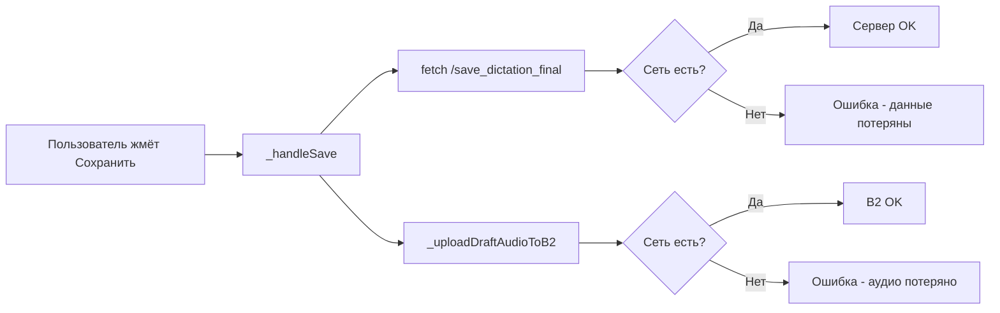
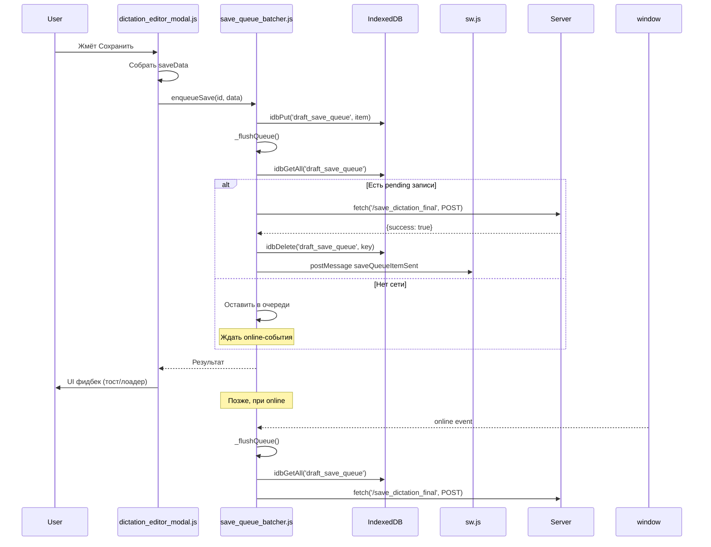

# Архитектура очереди сохранения диктантов (SaveQueue)

## Текущее состояние (проблема)

Сейчас `_handleSave()` в [`dictation_editor_modal.js:3252`](../static/js/dictation_editor_modal.js:3252) отправляет данные **напрямую на сервер**:



**Проблема**: при нестабильном интернете пользователь теряет все изменения.

## Целевая архитектура

```mermaid
flowchart LR
    A[Пользователь жмёт Сохранить] --> B[1. _handleSaveWithQueue]
    B --> C[2. Сохранить в IndexedDB\nочередь draft_save_queue]
    C --> D[3. Показать UI: "Сохранено локально"]
    D --> E{Сеть есть?}
    E -->|Да| F[4. Отправить на сервер]
    E -->|Нет| G[5. Ждать online-события\nили следующей попытки]
    F --> H{Сервер ответил OK?}
    H -->|Да| I[6. Удалить из очереди]
    H -->|Нет| J[7. Оставить в очереди,\nповторить позже]
    G --> E
```

## Компоненты

### 1. IndexedDB store — `draft_save_queue`

Новый object store в [`idb_manager.js:14`](../static/js/idb_manager.js:14) (рядом с существующими `outbox`, `dictations`, `drafts`):

```javascript
// upgrade needed
if (!db.objectStoreNames.contains('draft_save_queue')) {
    db.createObjectStore('draft_save_queue', { keyPath: 'key' });
}
```

**Структура записи:**
```typescript
interface DraftSaveQueueItem {
    key: string;           // 'save:{dictationId}:{timestamp}'
    type: 'draft_save';
    dictationId: string;
    payload: {
        // Полный saveData (как в _handleSave сейчас)
        sentences: SentencePayload[];
        language_original: string;
        language_translation: string;
        title: string;
        level: string;
        is_dialog: boolean;
        audio_order: string;
        book_id: number | null;
        cover_b64: string | null;
        audio_user_shared: string | null;
        // Для аудио — не base64, а инструкция "взять из кеша"
        audio_instructions: AudioInstruction[];
    };
    status: 'pending' | 'sending' | 'failed';
    createdAt: number;
    updatedAt: number;
    retryCount: number;
    lastError: string | null;
}
```

**Аудио-инструкции** (вместо передачи гигантских base64):
```typescript
interface AudioInstruction {
    lang: string;
    key: string;
    field: 'audio' | 'audio_file' | 'audio_mic';
    // Не храним blob в очереди — аудио уже в MEDIA_CACHE_PERSIST
    // или будет загружено отдельно
    source: 'cache_key' | 'b2_path';
    cacheKey?: string;     // для аудио из кеша
    b2Path?: string;       // если уже на B2
}
```

### 2. SaveQueueBatcher — новый модуль

Создать файл [`static/js/save_queue_batcher.js`](../static/js/save_queue_batcher.js).

По аналогии с [`OutboxBatcher`](../static/js/outbox_batcher.js):

```javascript
(function () {
    if (window.SaveQueueBatcher) return;

    const RETRY_INTERVAL_MS = 30000;    // 30 секунд между повторами
    const MAX_RETRY_COUNT = 10;          // потом остановиться
    const BATCH_INTERVAL_MS = 5000;      // проверять очередь раз в 5 секунд

    const state = {
        timerId: null,
        flushing: false,
        _retryFlush: false,
    };

    async function enqueueSave(dictationId, saveData) {
        // 1. Создаём запись
        const key = `save:${dictationId}:${Date.now()}`;
        const item = {
            key,
            type: 'draft_save',
            dictationId,
            payload: saveData,
            status: 'pending',
            createdAt: Date.now(),
            updatedAt: Date.now(),
            retryCount: 0,
            lastError: null,
        };
        // 2. Пишем в IndexedDB
        await window.IdbManager.idbPut('draft_save_queue', item);
        // 3. Пытаемся отправить
        _scheduleFlush();
        return key;
    }

    async function _flushQueue() {
        // 1. Читаем все pending-записи
        const rows = await window.IdbManager.idbGetAll('draft_save_queue');
        const pending = rows.filter(r => r.type === 'draft_save' && r.status === 'pending');
        
        for (const item of pending) {
            // 2. Помечаем как sending
            item.status = 'sending';
            await window.IdbManager.idbPut('draft_save_queue', item);
            
            try {
                // 3. Отправляем БД
                const dbResp = await fetch('/save_dictation_final', {
                    method: 'POST',
                    headers: { 'Content-Type': 'application/json', 'Authorization': 'Bearer ' + token },
                    body: JSON.stringify(item.payload)
                });
                
                if (!dbResp.ok) throw new Error('DB save failed: ' + dbResp.status);
                const dbResult = await dbResp.json();
                if (!dbResult.success) throw new Error('DB save error: ' + (dbResult.error || 'unknown'));

                // 4. Отправляем аудио (только если есть dirty audio)
                if (item.payload._audioDirty) {
                    await _uploadAudioToB2(item.dictationId, token);
                }

                // 5. Успех — удаляем из очереди
                await window.IdbManager.idbDelete('draft_save_queue', item.key);
                console.log('[SaveQueue] Успешно отправлен:', item.dictationId);
            } catch (e) {
                // 6. Ошибка — увеличиваем счётчик и оставляем в очереди
                item.status = 'pending';
                item.retryCount = (item.retryCount || 0) + 1;
                item.lastError = String(e);
                item.updatedAt = Date.now();
                await window.IdbManager.idbPut('draft_save_queue', item);
                console.warn('[SaveQueue] Ошибка отправки:', item.key, e);
            }
        }
    }

    // Обработчик online-события
    window.addEventListener('online', () => {
        console.log('[SaveQueue] Появился интернет — пробуем отправить');
        _flushQueue();
    });

    window.SaveQueueBatcher = {
        enqueueSave,
        flushAll: _flushQueue,
        getQueueInfo: async () => {
            const rows = await window.IdbManager.idbGetAll('draft_save_queue') || [];
            return {
                total: rows.length,
                pending: rows.filter(r => r.status === 'pending').length,
                failed: rows.filter(r => r.status === 'failed').length,
            };
        },
    };
})();
```

### 3. Модификация `_handleSave()` в [`dictation_editor_modal.js`](../static/js/dictation_editor_modal.js:3252)

```mermaid
flowchart TD
    A[Пользователь жмёт Сохранить] --> B{SaveQueueBatcher существует?}
    B -->|Да| C[Собрать saveData как сейчас]
    B -->|Нет| D[Старый путь: прямой fetch]
    C --> E[Показать DesktopLoadingModal\n"Збереження даних..."]
    E --> F[enqueueSave dictationId, saveData]
    F --> G{Очередь пуста?\n(первая попытка)}
    G -->|Да, сеть есть| H[Выполнить flushQueue\nсразу]
    G -->|Нет, или нет сети| I[Данные в очереди,\nотправятся позже]
    H --> J{Успешно?}
    J -->|Да| K[Удалить из очереди,\nобновить десктоп]
    J -->|Нет| L[Оставить в очереди,\nповторить по таймеру]
    I --> M[Скрыть DesktopLoadingModal\nПоказать тост\n"Дані збережено локально,\nнадішлемо при з'єднанні"]
    K --> M
    L --> M
```

**Изменения в `_handleSave()`:**

```javascript
async function _handleSave() {
    // ... собираем saveData как сейчас ...
    
    // НОВО: если есть SaveQueueBatcher — используем очередь
    if (window.SaveQueueBatcher && typeof window.SaveQueueBatcher.enqueueSave === 'function') {
        try {
            window.DesktopLoadingModal.show('Збереження даних...');
            
            // Добавляем флаг dirty audio (чтобы batcher знал, нужно ли загружать аудио)
            saveData._audioDirty = flags.audio;
            
            // Сохраняем в очередь IndexedDB
            await window.SaveQueueBatcher.enqueueSave(effectiveDictationId, saveData);
            
            // Пробуем сразу отправить (если есть сеть)
            await window.SaveQueueBatcher.flushAll();
            
            // Проверяем осталась ли запись в очереди
            const queueInfo = await window.SaveQueueBatcher.getQueueInfo();
            if (queueInfo.pending === 0) {
                // Отправлено успешно — обновляем десктоп
                try {
                    if (window.Desktop && typeof window.Desktop.loadDeskItems === 'function') {
                        await window.Desktop.loadDeskItems();
                    }
                } catch (e) {}
                window.DesktopLoadingModal.hide();
                // Показываем тост об успехе
            } else {
                // Данные в очереди — показываем тост об отсроченной отправке
                window.DesktopLoadingModal.hide();
                _showToast('Дані збережено локально, надішлемо при з\'єднанні');
            }
            
            _setDirtyFlags({ db: false, audio: false, cover: false });
            return true;
        } catch (e) {
            console.error('[dictationEditorModal] Ошибка очереди сохранения:', e);
            window.DesktopLoadingModal.hide();
            return false;
        }
    }
    
    // СТАРЫЙ путь (если SaveQueueBatcher не загружен)
    // ... существующий код ...
}
```

### 4. Интеграция SW для фоновой отправки

SW получает сообщение от SaveQueueBatcher:

```javascript
// В SaveQueueBatcher._flushQueue — после успеха
navigator.serviceWorker.controller.postMessage({
    action: 'saveQueueItemSent',
    payload: { key: item.key, dictationId: item.dictationId }
});
```

В [`sw.js:1095`](../sw.js:1095) (message handler) добавить:

```javascript
if (action === 'saveQueueItemSent') {
    // Можем уведомить другие вкладки
    broadcastSwEvent('draft_save_sent', { dictationId: data.dictationId });
    return;
}
```

### 5. UI-фидбек для пользователя

1. **DesktopLoadingModal** — "Збереження даних..." (уже есть)
2. **Тост при офлайн-сохранении**: "Дані збережено локально, надішлемо при з'єднанні"
3. **Индикатор в шапке**: если в очереди есть pending-записи — показывать маленький оранжевый индикатор рядом с дискеткой
4. **Не закрывать модалку** если сохранение не удалось — или закрывать но с предупреждением

## План реализации

### Шаг 1: IndexedDB — новый store
- Файл: [`static/js/idb_manager.js`](../static/js/idb_manager.js:14) (строка 14, `req.onupgradeneeded`)
- Добавить `db.createObjectStore('draft_save_queue', { keyPath: 'key' })`
- **Версию БД не увеличивать** — используем проверку `if (!db.objectStoreNames.contains('draft_save_queue'))`

### Шаг 2: SaveQueueBatcher — новый модуль
- Файл: `static/js/save_queue_batcher.js` (новый)
- Реализовать: `enqueueSave()`, `_flushQueue()`, online-обработчик
- Подключить в HTML (после `idb_manager.js`, до `dictation_editor_modal.js`)

### Шаг 3: Модификация `_handleSave()`
- Файл: [`static/js/dictation_editor_modal.js`](../static/js/dictation_editor_modal.js:3252)
- Заменить прямой `fetch` на `SaveQueueBatcher.enqueueSave()` + `flushAll()`
- Если очередь пуста после flush — всё как сейчас (обновление десктопа, тост успеха)
- Если не пуста — тост об отсроченной отправке
- После успешной отправки с сервера — `_setDirtyFlags({ db: false, audio: false, cover: false })`

### Шаг 4: Аудио — отдельная обработка
- Аудиофайлы НЕ класть в IndexedDB (они большие)
- Аудио уже в MEDIA_CACHE_PERSIST (закешированы SW при генерации)
- В очереди хранить только инструкцию: `{ lang, key, field, cacheKey: '/api/dictations/...' }`
- При отправке: достать из кеша SW, загрузить в B2

### Шаг 5: SW message handler
- Файл: [`sw.js`](../sw.js:1095)
- Добавить обработку `saveQueueItemSent`

### Шаг 6: UI фидбек
- Оранжевый индикатор pending-сохранений возле кнопки сохранения
- Тост при офлайн-режиме

## Что НЕ меняется

- **Не трогаем OutboxBatcher** — он отвечает за статистику диктантов (звёзды, монеты), это другая очередь
- **Не трогаем prefetchDictationToCache** — он для чтения, не для записи
- **Не трогаем существующий `_handleSave()`** полностью — только добавляем conditional path в начале

## Диаграмма потоков данных



## Риски и замечания

1. **Конфликты при повторном открытии**: Если пользователь сохранил офлайн, закрыл модалку, открыл снова и отредактировал — в очереди будет старая версия. Нужно: при открытии редактора проверять очередь и удалять старые записи для этого dictationId.

2. **Размер очереди**: Не хранить blob аудио в IndexedDB — только ссылки на кеш.

3. **Безопасность**: Токен может протухнуть к моменту отправки. Нужно: при отправке проверять `_hasToken()` как в OutboxBatcher.

4. **Cover**: Обложка передаётся как base64 — она маленькая (несколько КБ), можно хранить в очереди.
