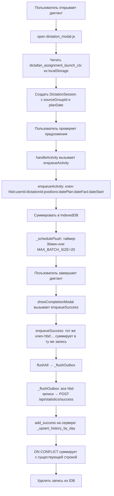

# Исправление архитектуры очереди OutboxBatcher

## Проблема

При диктанте из 20 предложений данные удваиваются: 30 звёзд вместо 20, 30 микрофонов вместо 20, 24 ошибки вместо 15.

### Корень проблемы

В [`outbox_batcher.js`](static/js/outbox_batcher.js:199) activity и success имеют **разные ключи** в IndexedDB:

- **Activity key**: `act:{userId}:{dateId}:{dictationId}:{selPosStr}:{dateStartStr}`
- **Success key**: `suc:{userId}:{rawId}:{dateId}`

Из-за разных ключей они могут быть отправлены **отдельными запросами**:

1. Когда `pendingCount` достигает `MAX_BATCH_SIZE=20` (после 10 предложений), срабатывает фоновая отправка (`_scheduleFlush` → `_flushOutbox`). Activity для предложений 000-009 отправляется как `POST /api/statistics/activity` → `_upsert_history_by_day(perfect_delta=10)`.

2. После завершения диктанта `showCompletionModal()` вызывает `enqueueSuccess()` с **общими totals** (20 perfect, 20 audio, 15 ошибок), а затем `flushAll()`.

3. `_flushOutbox()` находит пару activity+success для одного `dictation_id`, склеивает их через `_mergeActivityIntoSuccess()` и отправляет `POST /api/statistics/success` → `_upsert_history_by_day(perfect_delta=20)`.

4. **Итог**: сервер суммирует: 10 (из activity) + 20 (из success) = **30**.

### Почему увеличение MAX_BATCH_SIZE до 10000 — неправильное решение

Я неправильно увеличил `MAX_BATCH_SIZE` с 20 до 10000, думая что это предотвратит фоновую отправку. Но проблема не в `MAX_BATCH_SIZE`, а в разных ключах. После перехода на единый ключ `MAX_BATCH_SIZE` не нужен — отправка будет только по таймеру (30 минут) и при завершении диктанта (`flushAll`).

## Решение: единый ключ для activity и success

### Принцип

Activity и success должны использовать **один и тот же ключ** в IndexedDB, совпадающий с уникальным ключом строки в [`history_by_day`](helpers/db_history.py:120):

```
(user_id, teacher_id, dictation_id, positions, date_plan, date_fact, date_start)
```

Ключ в outbox: `hbd:{userId}:{teacherId}:{dictationId}:{positions}:{datePlan}:{dateFact}:{dateStart}`

Когда приходит activity — она суммируется в существующую запись (или создаёт новую).
Когда приходит success — он суммируется в ту же запись.
Когда `_flushOutbox()` отправляет — он отправляет **один** запрос `POST /api/statistics/success` с суммарными данными.

### Что это даёт

- **Нет раздельных activity/success ключей** → нет двух отдельных запросов → нет удвоения.
- **Нет фоновой отправки activity без success** → `_flushOutbox` по таймеру или `MAX_BATCH_SIZE` отправляет то, что накопилось, и это всегда корректные суммарные данные.
- **Нет `_mergeActivityIntoSuccess()`** → не нужна, т.к. данные уже в одной записи.
- **Нет отдельного `POST /api/statistics/activity`** → все данные идут через `POST /api/statistics/success`.
- **Нет проблемы с несколькими днями** → если диктант выполняется 2 дня, в первый день отправятся данные за первый день (с `date_fact=первый_день`), во второй — за второй (с `date_fact=второй_день`). Ключи разные, данные не смешиваются.

### Что нужно изменить

#### 1. [`DictationSession`](static/js/dictation_runtime/dictation_store.js:147) — добавить поля

Добавить поля `sourceGroupId` и `planDate` в класс `DictationSession`:

```javascript
class DictationSession {
  constructor(opts = {}) {
    // ... существующие поля ...
    this.sourceGroupId = opts.sourceGroupId || null;   // ID группы (для teacher_id)
    this.planDate = opts.planDate || null;              // дата плана (из assignment)
  }
}
```

#### 2. Чтение assignment launch context при открытии диктанта

Сейчас [`_setAssignmentLaunchContext()`](static/js/student_plan_panel.js:140) сохраняет `{ plan_date, source_group_id, ... }` в localStorage, но **никто его не читает**. Нужно:

- В [`open()`](static/js/dictation_modal.js:6687) функции `dictation_modal.js` — при открытии диктанта читать `dictafan_assignment_launch_ctx` из localStorage.
- Если контекст есть и `dictation_id` совпадает — передавать `plan_date` и `source_group_id` в сессию.
- Если контекст есть, но `dictation_id` не совпадает — игнорировать (это от предыдущего запуска).
- После прочтения — **удалять** контекст из localStorage, чтобы он не применялся к следующему диктанту.

#### 3. [`getOrCreateDefaultSessionFromParsed()`](static/js/dictation_modal.js:4773) — передавать assignment данные

Функция создаёт сессию через `store.getOrCreateSession()`. Нужно передавать `sourceGroupId` и `planDate` в opts сессии.

#### 4. [`handleActivity()`](static/js/dictation_modal.js:3378) — передавать sourceGroupId и planDate

При вызове `ob.enqueueActivity()` нужно передавать:
- `sourceGroupId: session.sourceGroupId`
- `planDate: session.planDate`

#### 5. [`showCompletionModal()`](static/js/dictation_modal.js:1007) — передавать sourceGroupId и planDate

При вызове `ob.enqueueSuccess()` нужно передавать:
- `source_group_id: session.sourceGroupId`
- `plan_date: session.planDate`

#### 6. [`outbox_batcher.js`](static/js/outbox_batcher.js) — единый ключ

**6a. Изменить `enqueueActivity()`:**

- Ключ: `hbd:{userId}:{teacherId}:{dictationId}:{positions}:{datePlan}:{dateFact}:{dateStart}`
- `teacherId` — если передан `sourceGroupId`, то `teacherId` нужно получить. Но на клиенте мы не знаем `teacher_id` — его резолвит сервер. **Решение**: передавать `source_group_id` в payload, а ключ формировать без `teacher_id`. Сервер сам резолвит `teacher_id` из `source_group_id`.
- Новый ключ: `hbd:{userId}:{dictationId}:{positions}:{datePlan}:{dateFact}:{dateStart}`
- Если `planDate` нет (диктант с рабочего стола) — `datePlan = dateFact`.
- Если `sourceGroupId` нет — `teacher_id = user_id` (как сейчас в `add_activity()`).
- Все поля (perfect_count, corrected_count, audio_count, mistake_count, etc.) суммируются в одну запись.

**6b. Изменить `enqueueSuccess()`:**

- Использовать **тот же ключ**, что и `enqueueActivity()`.
- Вместо отдельного ключа `suc:{userId}:{rawId}:{dateId}` — использовать `hbd:{userId}:{dictationId}:{positions}:{datePlan}:{dateFact}:{dateStart}`.
- Success просто суммирует свои дельты в ту же запись.
- **Удалить `_mergeSuccessPayloads()`** — больше не нужно, т.к. данные суммируются через ту же логику что и activity.

**6c. Изменить `_flushOutbox()`:**

- Убрать логику поиска пар activity+success.
- Убрать `_mergeActivityIntoSuccess()`.
- Убрать отправку `POST /api/statistics/activity`.
- Все записи типа `hbd` отправляются как `POST /api/statistics/success`.
- После успешной отправки — удалять запись из IDB.

**6d. Удалить `_mergeActivityIntoSuccess()`** — больше не нужна.

**6e. Удалить `_mergeSuccessPayloads()`** — больше не нужна.

**6f. Убрать `MAX_BATCH_SIZE`** — отправка только по таймеру `BATCH_INTERVAL_MS=1800000` (30 минут) и при `flushAll()` в конце диктанта. `_scheduleFlush()` не проверяет `pendingCount >= MAX_BATCH_SIZE`.

#### 7. Сервер: [`add_success()`](helpers/db_history.py:1016) — принимать source_group_id

Сейчас `add_success()` уже принимает `source_group_id` и резолвит `teacher_id` через `_resolve_teacher_id()`. Нужно убедиться, что `plan_date` тоже передаётся.

**Важно**: `add_activity()` сейчас передаёт `teacher_id=int(user_id)` (всегда сам себе). После перехода на единый ключ activity больше не будет отправляться отдельно — все данные идут через `add_success()`, которая правильно резолвит `teacher_id`.

#### 8. Сервер: удалить `POST /api/statistics/activity` endpoint

После перехода на единый ключ endpoint `POST /api/statistics/activity` больше не нужен. Можно удалить или оставить для обратной совместимости (но он не будет использоваться).

## План выполнения

### Шаг 1: Добавить поля в DictationSession

Файл: [`static/js/dictation_runtime/dictation_store.js`](static/js/dictation_runtime/dictation_store.js)

- Добавить `this.sourceGroupId = null` и `this.planDate = null` в конструктор.
- Добавить их в `toJSON()` и `fromJSON()`.
- Добавить параметры `sourceGroupId` и `planDate` в `getOrCreateSession()`.

### Шаг 2: Читать assignment launch context при открытии диктанта

Файл: [`static/js/dictation_modal.js`](static/js/dictation_modal.js)

- В функции `open()` — после строки ~6762 (где читается `subsetPositions`) — добавить чтение `dictafan_assignment_launch_ctx` из localStorage.
- Если контекст есть и `dictation_id` совпадает — сохранить `plan_date` и `source_group_id`.
- Удалить контекст из localStorage после прочтения.
- Передать эти данные в `getOrCreateDefaultSessionFromParsed()`.

### Шаг 3: Передавать sourceGroupId и planDate в handleActivity()

Файл: [`static/js/dictation_modal.js`](static/js/dictation_modal.js)

- В `handleActivity()` — добавить `sourceGroupId: session.sourceGroupId` и `planDate: session.planDate` в params для `enqueueActivity()`.

### Шаг 4: Передавать source_group_id и plan_date в showCompletionModal()

Файл: [`static/js/dictation_modal.js`](static/js/dictation_modal.js)

- В `showCompletionModal()` — добавить `source_group_id: session.sourceGroupId` и `plan_date: session.planDate` в payload для `enqueueSuccess()`.

### Шаг 5: Переписать enqueueActivity() — единый ключ

Файл: [`static/js/outbox_batcher.js`](static/js/outbox_batcher.js)

- Новый ключ: `hbd:{userId}:{dictationId}:{selPosStr}:{datePlan}:{dateFact}:{dateStartStr}`
- Принимать новые params: `sourceGroupId`, `planDate`.
- Если `planDate` нет → `datePlan = dateFact`.
- Все поля суммируются в одну запись (как сейчас).
- Добавить поля `source_group_id`, `plan_date`, `teacher_id` (будет зарезолвлен на сервере) в запись.

### Шаг 6: Переписать enqueueSuccess() — единый ключ

Файл: [`static/js/outbox_batcher.js`](static/js/outbox_batcher.js)

- Использовать тот же ключ, что и `enqueueActivity()`.
- Вместо отдельного `suc:{userId}:{rawId}:{dateId}` — формировать `hbd:{userId}:{dictationId}:{positions}:{datePlan}:{dateFact}:{dateStart}`.
- Вместо `_mergeSuccessPayloads()` — просто суммировать поля (как в `enqueueActivity()`).
- Удалить `_mergeSuccessPayloads()`.

### Шаг 7: Переписать _flushOutbox() — единый тип записей

Файл: [`static/js/outbox_batcher.js`](static/js/outbox_batcher.js)

- Все записи типа `hbd` отправляются как `POST /api/statistics/success`.
- Убрать логику поиска пар activity+success.
- Убрать `_mergeActivityIntoSuccess()`.
- Убрать отправку `POST /api/statistics/activity`.
- Убрать `activityRows`, `successRows`, `mergedPairs` — теперь только `hbdRows`.

### Шаг 8: Убрать MAX_BATCH_SIZE, оставить только таймер 30 минут

Файл: [`static/js/outbox_batcher.js`](static/js/outbox_batcher.js)

- Удалить константу `MAX_BATCH_SIZE` (строка 24).
- В `_scheduleFlush()` убрать проверку `if (state.pendingCount >= MAX_BATCH_SIZE)` — оставить только таймер `BATCH_INTERVAL_MS`.
- Отправка происходит: раз в 30 минут по таймеру, и при `flushAll()` в конце диктанта.

### Шаг 9: Удалить мёртвый код

Файл: [`static/js/outbox_batcher.js`](static/js/outbox_batcher.js)

- Удалить функцию `_mergeActivityIntoSuccess()`.
- Удалить функцию `_mergeSuccessPayloads()`.
- Удалить функцию `removeActivity()` (уже удалена, проверить).
- Обновить комментарии.

### Шаг 10: Проверить серверную часть

Файл: [`helpers/db_history.py`](helpers/db_history.py)

- `add_success()` уже принимает `source_group_id` и резолвит `teacher_id`.
- `add_success()` уже принимает `date_start` и вычисляет `date_plan` из него.
- Убедиться, что `plan_date` передаётся правильно (сейчас `date_plan` вычисляется из `date_start`).
- Если клиент передаёт `plan_date` — использовать его вместо вычисленного из `date_start`.

### Шаг 11: Проверить endpoint POST /api/statistics/activity

Файл: [`routes/statistics.py`](routes/statistics.py)

- После перехода endpoint больше не используется клиентом.
- Можно оставить для обратной совместимости (старые данные в очереди).
- Или удалить, если старых данных гарантированно нет.

## Схема потока данных после исправления



## Почему это безопасно для сценария "несколько дней"

Если пользователь выполнил 10 предложений сегодня, а остальные 10 — завтра:

1. **День 1**: 10 предложений → `enqueueActivity` 10 раз → `pendingCount=10` → таймер 30 мин → данные остаются в IDB.
2. **День 1, закрытие страницы**: данные в IDB сохраняются (сессия persist-ится).
3. **День 2**: пользователь открывает диктант, сессия восстанавливается из IDB.
4. **День 2**: ещё 10 предложений → `enqueueActivity` ещё 10 раз → `pendingCount=20` → таймер 30 мин → `_flushOutbox`.
5. `_flushOutbox` отправляет `POST /api/statistics/success` с `date_fact=сегодня` (день 2).
6. **Проблема**: данные за день 1 не отправлены! Они остались в IDB с `date_fact=день1`.

**Решение**: при восстановлении сессии из IDB (в `fromJSON`), нужно также вызывать `flushAll()` для отправки накопившихся данных. Или, при открытии диктанта, проверять, есть ли неотправленные записи в outbox для этого диктанта, и отправлять их.

**Более простое решение**: `_scheduleFlush` запускается при каждом `enqueueActivity`. Если пользователь открыл диктант на второй день и начал проверять предложения — `enqueueActivity` вызовет `_scheduleFlush` (если прошло 30 минут с последней отправки), который отправит старые данные (с `date_fact=день1`). Новые данные будут с `date_fact=день2`. Ключи разные — данные не смешиваются.

**НО**: если пользователь просто открыл диктант на второй день, но ещё не начал проверять — старые данные не отправятся. Нужно при открытии диктанта вызывать `flushAll()`.

**Дополнительно**: при открытии диктанта в [`open()`](static/js/dictation_modal.js:6687) — вызывать `ob.flushAll()` для отправки всего, что накопилось.
