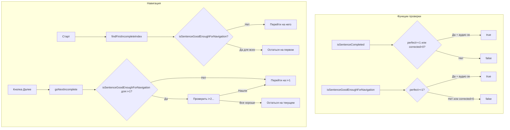

# План: Навигация на первое невыполненное предложение при старте/далее

## Проблема

При возврате в диктант (сессия уже есть, несколько предложений выполнены) нажатие "Старт" всегда сбрасывает на первое предложение (`session.currentSelectedIndex = 0`). Пользователь вынужден вручную листать до невыполненных предложений.

## Требование

Два режима проверки "закрытости" предложения:

1. **isSentenceCompleted(key, session)** — предложение полностью закрыто: **звезда ИЛИ полузвезда** (если режим без текста — то без текста) **И** аудио (если требуется). Используется для определения, завершён ли диктант целиком (showCompletionModal).

2. **isSentenceGoodEnoughForNavigation(key, session)** — предложение достаточно хорошо для навигации: **только звезда** (полузвезда НЕ считается достаточной, пользователь может ещё улучшить) **И** аудио (если требуется). Используется для:
   - **Старт** — перейти на первое предложение, которое НЕ `isSentenceGoodEnoughForNavigation`
   - **Далее** — перейти на следующее предложение, которое НЕ `isSentenceGoodEnoughForNavigation`

## Текущий код

### `computeSentenceCompletionState(st)` — строка 2232

```javascript
function computeSentenceCompletionState(st) {
  const perfect = Number(st && st.number_of_perfect) || 0;
  const corrected = Number(st && st.number_of_corrected) || 0;
  const audioDone = Number(st && st.number_of_audio) || 0;
  const requiresAudio = getRequiredAudioRepeatsValue();
  const mode = getExerciseMode();
  const textOk = (mode === 'audio-only-no-hint' || mode === 'audio-only-hint') ? true : (perfect >= 1 || corrected > 0);
  const audioOk = requiresAudio <= 0 || audioDone >= requiresAudio;
  return { textOk, audioOk, requiresAudio };
}
```

Уже существует, возвращает `{ textOk, audioOk, requiresAudio }`. Используется в `updateNextButtonVisibilityFromSession` для текущего предложения.

### `session.goNext()` — `dictation_store.js:254`

Просто инкрементирует `currentSelectedIndex`. Не проверяет выполненность.

### Старт — строка 1059-1060

```javascript
session.ensureDefaultSelection();
session.currentSelectedIndex = 0;  // <-- проблема
```

### `window.nextSentence` — строка 1071

```javascript
session.goNext();  // просто +1 к индексу
```

## План изменений

### Шаг 1: Создать `isSentenceCompleted(key, session)`

Для определения полностью закрытого предложения (звезда ИЛИ полузвезда + аудио).

```javascript
function isSentenceCompleted(key, session) {
  try {
    if (!key || !session || typeof session.getState !== 'function') return false;
    const st = session.getState(String(key));
    if (!st) return false;
    const { textOk, audioOk } = computeSentenceCompletionState(st);
    return !!(textOk && audioOk);
  } catch (e) {
    return false;
  }
}
```

### Шаг 2: Создать `isSentenceGoodEnoughForNavigation(key, session)`

Для навигации — только звезда (НЕ полузвезда) + аудио.

```javascript
function isSentenceGoodEnoughForNavigation(key, session) {
  try {
    if (!key || !session || typeof session.getState !== 'function') return false;
    const st = session.getState(String(key));
    if (!st) return false;
    const perfect = Number(st.number_of_perfect) || 0;
    const audioDone = Number(st.number_of_audio) || 0;
    const requiresAudio = getRequiredAudioRepeatsValue();
    const mode = getExerciseMode();
    // В режимах без текста текст всегда ок
    const textOk = (mode === 'audio-only-no-hint' || mode === 'audio-only-hint') ? true : (perfect >= 1);
    const audioOk = requiresAudio <= 0 || audioDone >= requiresAudio;
    return !!(textOk && audioOk);
  } catch (e) {
    return false;
  }
}
```

Отличие от `computeSentenceCompletionState`: `corrected` (полузвезда) НЕ учитывается — `perfect >= 1` вместо `perfect >= 1 || corrected > 0`.

### Шаг 3: Создать `findFirstIncompleteIndex(session)`

Ищет первый индекс в `session.selectedKeys`, для которого `isSentenceGoodEnoughForNavigation` возвращает `false`. Если все "достаточно хороши" — возвращает 0.

```javascript
function findFirstIncompleteIndex(session) {
  try {
    const keys = session.selectedKeys || [];
    for (let i = 0; i < keys.length; i++) {
      if (!isSentenceGoodEnoughForNavigation(keys[i], session)) {
        return i;
      }
    }
  } catch (e) {}
  return 0;
}
```

### Шаг 4: Создать `goNextIncomplete(session)`

Переходит на следующее предложение, которое НЕ `isSentenceGoodEnoughForNavigation` (начиная от текущего + 1). Если все последующие "достаточно хороши" — остаётся на текущем.

```javascript
function goNextIncomplete(session) {
  try {
    const keys = session.selectedKeys || [];
    const startIdx = session.currentSelectedIndex != null ? session.currentSelectedIndex : 0;
    for (let i = startIdx + 1; i < keys.length; i++) {
      if (!isSentenceGoodEnoughForNavigation(keys[i], session)) {
        session.currentSelectedIndex = i;
        return session.getCurrentKey();
      }
    }
    // Все последующие закрыты — остаёмся на текущем
    return session.getCurrentKey();
  } catch (e) {
    return session ? session.goNext() : null;
  }
}
```

### Шаг 5: Изменить Старт (строка 1060)

Заменить:
```javascript
session.currentSelectedIndex = 0;
```
На:
```javascript
session.currentSelectedIndex = findFirstIncompleteIndex(session);
```

### Шаг 6: Изменить `window.nextSentence` (строка 1081)

Заменить:
```javascript
session.goNext();
```
На:
```javascript
goNextIncomplete(session);
```

### Шаг 7: Проверить синтаксис

```bash
node -c static/js/dictation_modal.js
```

## Mermaid-диаграмма



## Файлы для изменения

- `static/js/dictation_modal.js` — добавить 4 функции, изменить 2 места (Старт, nextSentence)
