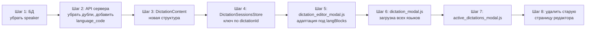

# План рефакторинга DictationContent

## Цель

Привести структуру `DictationContent` (клиентский класс) в соответствие со структурой таблицы `dictation_sentences` в БД, чтобы поддержать несколько языков перевода и убрать дублирование полей.

## Новая структура данных

### 1. БД (`dictation_sentences`)

**Текущая структура** (оставить, но убрать `speaker`):

```
id, dictation_id, language_code, sentence_key, text, explanation,
audio, audio_mic, audio_file, start, "end", chain, checked, position
```

**Изменения**: удалить колонку `speaker`.

### 2. API сервера (`routes/dictation.py`)

**Сейчас** (с дублями):
```json
{
  "key": "000",
  "position": 1,
  "text": "Hello",
  "translation": "Привет",
  "audio": "/api/.../hello.mp3",
  "audio_a": "/api/.../hello.mp3",
  "audio_file": null,
  "audio_f": null,
  "audio_m": null,
  "audio_tr": "/api/.../privet.mp3",
  "start": "",
  "end": "",
  "speaker": null,
  "explanation": ""
}
```

**После рефакторинга** (чистая структура, mirror БД):
```json
{
  "key": "000",
  "language_code": "en",
  "position": 1,
  "text": "Hello",
  "audio": "/api/.../hello.mp3",
  "audio_file": null,
  "audio_mic": null,
  "start": "",
  "end": "",
  "explanation": ""
}
```

Каждое предложение имеет `language_code`. Для одного диктанта сервер отдаёт **массив** таких объектов для всех языков. Клиент сам группирует по `language_code` в `langBlocks`.

### 3. Клиент (`DictationContent`)

```javascript
class DictationContent {
  constructor({ dictationId, langOrig, audio_or_order, audio_or_shared, langBlocks }) {
    this.dictationId = dictationId;
    this.langOrig = langOrig;           // язык оригинала (en)
    this.audio_or_order = audio_or_order || '';   // переименовано из audio_order
    this.audio_or_shared = audio_or_shared || null; // переименовано из audio_user_shared
    this.langBlocks = [];               // [{ lang: 'en', sentences: [...] }, { lang: 'ru', sentences: [...] }]
    if (Array.isArray(langBlocks)) {
      this.setLangBlocks(langBlocks);
    }
  }
}
```

**Поля одного предложения** (внутри `sentences[]` языкового блока):
- `key` — ключ (строка)
- `position` — позиция (число или null)
- `text` — текст на этом языке
- `audio` — аудио (авто-озвучка)
- `audio_file` — загруженный файл
- `audio_mic` — микрофон
- `start` — начало (сек)
- `end` — конец (сек)
- `checked` — выбран по умолчанию
- `explanation` — пояснение

**Убраны поля**: `text_original`, `text_translation`, `audio_original`, `audio_translation`, `speaker`

### 4. Методы DictationContent

| Метод | Описание |
|-------|----------|
| `getOriginalSentences()` | `this.langBlocks.find(b => b.lang === this.langOrig)?.sentences \|\| []` |
| `getTranslationSentences(lang)` | `this.langBlocks.find(b => b.lang === lang)?.sentences \|\| []` |
| `getAllSentenceCores(lang?)` | Если lang указан — для этого языка, иначе для оригинала |
| `getSentence(key, lang?)` | Если lang указан — ищет в этом языке, иначе во всех |
| `getAllKeys(lang?)` | Ключи для указанного языка (или оригинала) |
| `getTranslationLanguages()` | Список языков, исключая `langOrig` |
| `addLangBlock(lang, sentences?)` | Добавить новый языковой блок |
| `removeLangBlock(lang)` | Удалить языковой блок |
| `setLangBlocks(blocks)` | Установить все языковые блоки |
| `toJSON()` | Сериализация |

## Изменения по файлам

### Шаг 1: БД — удалить speaker из dictation_sentences

- Файл: `migrations/remove_speaker_from_dictation_sentences.sql`
- SQL: `ALTER TABLE dictation_sentences DROP COLUMN speaker;`
- Обновить `helpers/db_dictations.py`:
  - `add_sentence()` — убрать параметр `speaker`
  - `update_sentence()` — убрать параметр `speaker`
  - `get_dictation_sentences()` — убрать `speaker` из SELECT

### Шаг 2: API сервера — убрать дубли

- Файл: `routes/dictation.py`
  - `api_get_dictation_sentences()` (line 383):
    - Убрать `audio_a`, `audio_f`, `audio_m` (дубли)
    - Убрать `audio_tr` (некорректно для многих языков)
    - Убрать `speaker`
    - Добавить `language_code` в каждое предложение
    - Отдавать **все** языки одним массивом (оригинал + все переводы)
    - Клиент сам группирует по `language_code`

- Файл: `routes/dictation_editor.py`
  - `save_dictation_final()` (line 1153):
    - Ожидать `sentences` как массив `[{ language_code, key, text, audio, ... }]`
    - Убрать маппинг `audio`/`audio_tr`/`audio_original`/`audio_translation`
    - Убрать `speaker` из сравнения и сохранения

### Шаг 3: DictationContent (dictation_store.js)

- Переименовать поля:
  - `audio_order` → `audio_or_order`
  - `audio_user_shared` → `audio_or_shared`
- Заменить `langTr` на `langBlocks: []`
- `setSentences()` → `setLangBlocks(blocks)` — принимает массив `{ lang, sentences: [...] }`
- `getAllSentenceCores(lang?)` — с параметром языка
- `getSentence(key, lang?)` — с параметром языка
- Убрать `speaker` из маппинга
- Убрать `text_original`, `text_translation`, `audio_original`, `audio_translation`

### Шаг 4: DictationSessionsStore (dictation_store.js)

- Ключ content: `dictationId` (без `langTr`)
- `getOrCreateContent({ dictationId, langOrig })` — без `langTr`
- `setContentSentences({ dictationId, langOrig, langBlocks })` — передавать все языки
- `getContent({ dictationId })` — по dictationId
- `getOrCreateSession()` — `langTr` остаётся для выбора языка перевода в сессии

### Шаг 5: dictation_editor_modal.js

- `_renderTable()` (line 457):
  - Читать `state.content.getOriginalSentences()` для колонок оригинала
  - Читать `state.content.getTranslationSentences(currentLang)` для колонок перевода
  - `s.text_original` → `origSentence.text`
  - `s.text_translation` → `trSentence.text`
  - `s.audio_translation` → `trSentence.audio`
  - `s.audio` / `s.audio_file` / `s.audio_mic` → `origSentence.audio` / etc

- `_addNewRow()` (line 1076):
  - Создавать предложение с полем `text`
  - Добавлять в оба языковых блока (оригинал и текущий перевод)

- `_deleteRow()` (line 1121):
  - Удалять из всех языковых блоков

- `_handleSave()` (line 2261):
  - Формировать `sentencesPayload` как массив `[{ language_code, key, text, audio, ... }]`
  - Для каждого `langBlock` формировать свой набор
  - `s.text_original` → `s.text` (из оригинала)
  - `s.text_translation` → `s.text` (из перевода)
  - `s.audio_original` → `s.audio` (из оригинала)
  - `s.audio_translation` → `s.audio` (из перевода)

- `open()` (line 2489):
  - Создавать `DictationContent` с `langBlocks`
  - Группировать `rawSentences` по `language_code`

- `NewDictationFillModal.create()` (line 3622):
  - Формировать `combinedSentences` с полем `text`
  - После создания разложить по языковым блокам

- `_updateEditorFromFillConfig()` (line 4089):
  - Восстанавливать `state.content` с новой структурой

- Все места с прямым доступом к `_sentences`:
  - Заменить на работу через `langBlocks`

### Шаг 6: dictation_modal.js

- `ensureDictationContentLoadedToRuntime()` (line 4504):
  - Загружать предложения для всех языков
  - Передавать `langBlocks` в `store.setContentSentences()`

- `getOrCreateDefaultSessionFromParsed()` (line 4588):
  - Использовать `content.getAllKeys()` (для оригинала)

- `renderStartModalSentencesTable()` (line 4651):
  - Использовать `session.getSentenceView(key)` — без изменений

- `loadSentencesFromIndexedDb()` (line 4358):
  - Загружать все языки

- `fetchSentencesFromServerAndCache()` (line 4423):
  - Кешировать все языки

### Шаг 7: active_dictations_modal.js

- Обновить чтение `content.langTr` → работа с `langBlocks`

### Шаг 8: Удалить старую страницу редактора

- Файлы:
  - `templates/dictation_editor.html`
  - `static/js/script_dictation_editor.js`
  - `routes/dictation_editor.py` (проверить, какие роуты используются только старой страницей)
- Убедиться, что все функции, которые могут понадобиться, перенесены в `dictation_editor_modal.js`

## Порядок выполнения



## Примечания

- `audio_or_order` и `audio_or_shared` — поля уровня диктанта (не предложения), хранятся в таблице `dictations`
- `audio_or_order`: `''` (авто), `'f'` (файл), `'m'` (микрофон)
- `audio_or_shared`: имя файла общего аудио или null
- В таблице редактора колонки оригинала читают из `langBlock` с `lang === langOrig`
- В таблице редактора колонки перевода читают из `langBlock` с `lang === currentTranslationLang`
- Поля `audio_file` и `audio_mic` заполняются только для языка оригинала
