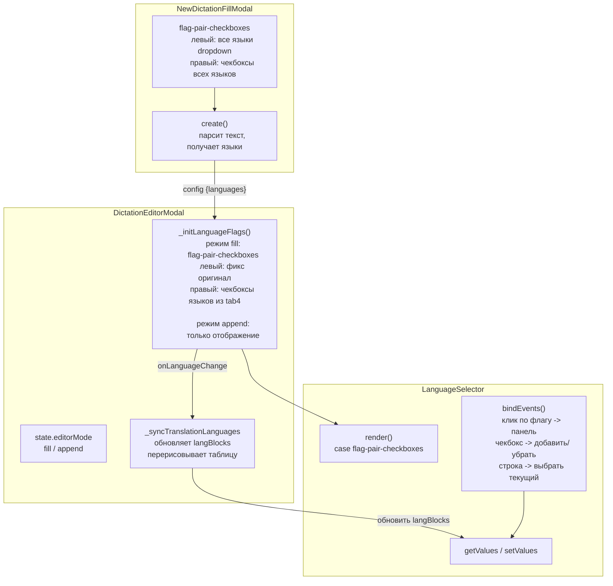

# План: Переработка механизма языковых флагов в модалке редактора диктанта

## 1. Текущее состояние (после изучения кода)

### `_initLanguageFlags()` (строки 1841-1899 в `dictation_editor_modal.js`)
- Читает `state.content.langBlocks`, собирает языки перевода (langBlocks[1:]),
- В зависимости от количества переводов:
  - 0 → `flag-single` (только флаг оригинала)
  - 1 → `flag-pair-fixed` (пара флагов)
  - >1 → `flag-pair-dropdown` (правый флаг — выпадающий список)

### `NewDictationFillModal._initLanguageSelector()` (строки 4939-5019)
- Использует `flag-pair-dropdown-both` — оба флага с выпадающими списками всех языков
- Левый: список ВСЕХ языков, по умолчанию изучаемый язык
- Правый: список ВСЕХ языков (кроме выбранного слева) + пустая строка "—"

### `LanguageSelector` (language_selector.js)
- Режимы для флагов: `flag-single`, `flag-pair-fixed`, `flag-pair-dropdown`, `flag-pair-dropdown-both`, `flag-pair-dropdown-left`, `flag-pair-dropdown-right`
- `getValues()` и `setValues()` уже есть (строки 3125-3142)
- `createLearningFlags()` (строки 263-289) — уже есть список с чекбоксами (используется для `learning-flags` в профиле)
- `bindEvents()` (строки 1712-2157) — обрабатывает события для всех режимов

### Проблемы
1. В редакторе при открытии существующего диктанта виден только один флаг + выпадающий список со всеми языками — непонятно, оригинал это или перевод
2. Нет механизма чекбоксов для выбора нескольких языков перевода (сейчас только один правый язык)
3. Нет разделения на режимы "начальное заполнение" и "дополнение"
4. Нет двусторонней синхронизации между fill modal и editor modal

---

## 2. Детальный план изменений

### Этап 1: Новый режим LanguageSelector — `flag-pair-checkboxes`

**Файл:** `static/js/language_selector.js`

#### 1.1. Новый метод `createFlagPairCheckboxes()` (~строки 1491-1561, после `createFlagPairDropdown()`)

```js
createFlagPairCheckboxes() {
  const leftLang = this.options.currentLearning;  // оригинал
  const currentTranslation = this.options.nativeLanguage;  // текущий отображаемый перевод
  const translationLangs = this.options.nativeLanguages || [];  // все языки перевода (checked)
  const allLangs = Object.keys(this.languageData || {});
  
  // HTML:
  // - .flag-pair-combo с data-mode="flag-pair-checkboxes"
  //   - левый флаг (фиксированный, без data-side)
  //   - стрелка →
  //   - правый флаг (data-side="right", кликабельный)
  // - .flag-pair-dropdown (скрытая панель, data-side="right")
  //   - .learning-flags-list со списком всех языков
  //     - для каждого: чекбокс + флаг + название языка
  //     - чекбокс checked = язык отмечен как переводной
  //     - строка с highlighted фоном = текущий отображаемый перевод
}
```

Логика:
- `currentLearning` → язык оригинала (левый флаг, неизменяемый)
- `nativeLanguage` → выбранный язык перевода для отображения (правый флаг)
- `nativeLanguages` → массив ВСЕХ языков, отмеченных чекбоксами (языки перевода)
- При клике на правый флаг — открывается/закрывается панель

#### 1.2. Обработчики в `bindEvents()` (строки 2077-2157)

Добавить новый case для `flag-pair-checkboxes`:
```js
if (this.options.mode === 'flag-pair-checkboxes') {
  // Клик по правому флагу → открыть/закрыть панель
  // Клик по чекбоксу → добавить/убрать язык из translationLangs
  // Клик по строке языка → сделать его текущим отображаемым (nativeLanguage)
  // Закрытие при клике вне
}
```

Использовать существующий механизм из `createLearningFlags()` + `flag-pair-dropdown`.

#### 1.3. Добавить case в `render()` (строка 1665)

```js
case 'flag-pair-checkboxes':
  html = this.createFlagPairCheckboxes();
  break;
```

#### 1.4. Обновить `getValues()` и `setValues()` (строки 3125-3142)

- `getValues()` уже возвращает `{ nativeLanguage, learningLanguages, currentLearning }` — достаточно
- `setValues()` уже обновляет и перерисовывает — достаточно

---

### Этап 2: Рефакторинг `_initLanguageFlags()` в редакторе

**Файл:** `static/js/dictation_editor_modal.js`, строки 1841-1899

#### 2.1. Определение режима работы

Добавить в `state`:
```js
editorMode: 'fill'  // 'fill' — начальное заполнение, 'append' — дополнение
```

#### 2.2. Новая логика `_initLanguageFlags()`:

```
function _initLanguageFlags() {
  const container = document.getElementById('editorModalLangPair');
  if (!container) return;
  
  const languageData = window.LanguageManager.getLanguageData();
  const orig = _normalizeLangCode(state.config.originalLanguage);
  if (!languageData[orig]) return;
  
  // Собираем языки перевода из langBlocks
  var translationLangs = [];
  if (state.content && state.content.langBlocks && state.content.langBlocks.length > 1) {
    for (var i = 1; i < state.content.langBlocks.length; i++) {
      translationLangs.push(state.content.langBlocks[i].lang);
    }
  }
  
  const mode = state.editorMode || 'fill';
  
  if (mode === 'fill') {
    // Режим "Начальное заполнение" — используем flag-pair-checkboxes
    state.headerLangPairSelector = window.initLanguageSelector('editorModalLangPair', {
      mode: 'flag-pair-checkboxes',
      currentLearning: orig,           // язык оригинала (левый флаг)
      nativeLanguage: translationLangs[0] || '',  // первый язык перевода для отображения
      nativeLanguages: translationLangs,          // все отмеченные чекбоксами
      languageData: languageData,
      onLanguageChange: function(values) {
        // При изменении — обновляем langBlocks и таблицу
        _syncTranslationLanguages(values.nativeLanguages, values.nativeLanguage);
      }
    });
  } else {
    // Режим "Дополнение" — флаги только для отображения (неактивны)
    if (translationLangs.length === 0) {
      state.headerLangPairSelector = window.initLanguageSelector('editorModalLangPair', {
        mode: 'flag-single',
        currentLearning: orig,
        ...
      });
    } else {
      state.headerLangPairSelector = window.initLanguageSelector('editorModalLangPair', {
        mode: 'flag-pair-fixed',
        currentLearning: orig,
        nativeLanguage: translationLangs[0] || '',
        ...
      });
    }
    // NOTE: В режиме "дополнение" селектор неактивен (display only)
  }
}
```

#### 2.3. Новая функция `_syncTranslationLanguages(langs, currentLang)`

Синхронизирует `langBlocks` при изменении списка языков перевода:

```js
function _syncTranslationLanguages(translationLangs, currentDisplayLang) {
  // 1. Получить текущие langBlocks
  // 2. Для каждого языка из translationLangs:
  //    - если его нет в langBlocks — добавить пустой блок
  // 3. Для каждого блока в langBlocks (кроме оригинала):
  //    - если языка нет в translationLangs — удалить блок
  // 4. Обновить state.config.translationLanguage = currentDisplayLang
  // 5. Перерисовать таблицу и таблицу переводов
  // 6. Пометить dirty flag
}
```

---

### Этап 3: Рефакторинг `NewDictationFillModal`

**Файл:** `static/js/dictation_editor_modal.js`, строки 4939-5019

#### 3.1. Изменить `_initLanguageSelector()`:

```js
_initLanguageSelector: function() {
  // ... та же логика получения defaultLearning и nativeLang ...
  
  self._languageSelector = window.initLanguageSelector('newDictationFillLangPair', {
    mode: 'flag-pair-checkboxes',  // <-- вместо flag-pair-dropdown-both
    currentLearning: defaultLearning,   // оригинал (левый флаг, но с выпадающим списком ВСЕХ языков)
    nativeLanguage: nativeLang,         // текущий отображаемый перевод (правый флаг)
    nativeLanguages: [nativeLang],      // языки перевода (чекбоксы), по умолчанию только родной
    languageData: languageData,
    onLanguageChange: function(values) {
      // Если оригинал = перевод — сбрасываем правый
      // (логика как сейчас)
    }
  });
}
```

**Важное отличие от editor modal:** в fill modal левый флаг ТОЖЕ должен открывать список всех языков (а не быть фиксированным). Для этого нужно, чтобы `flag-pair-checkboxes` поддерживал опцию `leftDropdown: true`.

#### 3.2. Модифицировать `_getSelectedLanguages()` (строки 4895-4933):

```js
_getSelectedLanguages: function() {
  var result = { original: '', translation: '', translationLanguages: [] };
  try {
    if (this._languageSelector && typeof this._languageSelector.getValues === 'function') {
      var values = this._languageSelector.getValues();
      if (values) {
        result.original = values.currentLearning || '';
        result.translation = values.nativeLanguage || '';
        result.translationLanguages = values.nativeLanguages || [];
      }
    }
  } catch (e) { }
  return result;
}
```

#### 3.3. Изменить `create()` (строки 4550-4844):

- Использовать `result.translationLanguages` для создания lang blocks при парсинге
- Если оригинал = перевод — не создавать перевод

---

### Этап 4: Двусторонняя синхронизация

**Файл:** `static/js/dictation_editor_modal.js`

#### 4.1. При передаче из fill modal в editor modal (`_updateEditorFromFillConfig`, строка 5137)

После вызова `_initLanguageFlags()` или `setValues()` — передать список языков перевода:
```js
if (config.translationLanguages && Array.isArray(config.translationLanguages)) {
  // Обновить langBlocks — добавить недостающие языки
}
```

#### 4.2. При изменении в editor modal

В `onLanguageChange` колбеке `_initLanguageFlags()`:
- Обновить `state.config.translationLanguages`
- Передать изменения в fill modal (если он открыт)

---

### Этап 5: Заголовок модалки — отображение режима

**Файл:** `templates/partials/dictation_editor_modal.html`

#### 5.1. Добавить элемент для отображения режима в `.dictation-editor-modal__header-container` (строка 33)

```html
<span id="dictationEditorModalMode" class="dictation-editor-modal__mode-badge"></span>
```

**Файл:** `static/css/dictation_editor_modal.css`

#### 5.2. Стили для `.dictation-editor-modal__mode-badge`

**Файл:** `static/js/dictation_editor_modal.js`

#### 5.3. В `open()` (строка ~3449) или после `_initLanguageFlags()`:

```js
function _updateEditorModeDisplay() {
  var modeEl = document.getElementById('dictationEditorModalMode');
  if (!modeEl) return;
  if (state.editorMode === 'fill') {
    modeEl.textContent = 'Начальное заполнение';
    // Стиль: жёлтый/зелёный badge
  } else {
    modeEl.textContent = 'Дополнение';
    // Стиль: серый badge
  }
}
```

#### 5.4. Установка режима

При открытии нового диктанта (новый/пустой):
```js
state.editorMode = 'fill';
```

При открытии существующего диктанта с данными:
```js
state.editorMode = 'append';
```

---

### Этап 6: CSS для новой панели с чекбоксами

**Файл:** `static/css/language_selector.css`

Стили для `.flag-pair-checkboxes-panel`:
- Список языков внутри панели (как `.learning-flags-list`)
- Чекбоксы с иконками (как `.learning-flag-checkbox`)
- Выделение текущей строки (highlighted)
- Позиционирование под правым флагом

**Файл:** `static/css/dictation_editor_modal.css`

Стили для `.dictation-editor-modal__mode-badge`

---

## 3. Сводная таблица изменений по файлам

| Файл | Изменения | Строки |
|------|-----------|--------|
| `static/js/language_selector.js` | Новый метод `createFlagPairCheckboxes()` | после строки 1561 |
| | Новый case в `render()` | строка 1665 |
| | Новый блок в `bindEvents()` | строки 2077-2157 |
| `static/js/dictation_editor_modal.js` | Добавить `editorMode` в `state` | строка 15 |
| | Переписать `_initLanguageFlags()` | строки 1841-1899 |
| | Новая функция `_syncTranslationLanguages()` | после строки 1899 |
| | Обновить `_updateEditorFromFillConfig()` | строки 5191-5205 |
| | Новая функция `_updateEditorModeDisplay()` | после `_initLanguageFlags` |
| | Обновить `_getSelectedLanguages()` | строки 4895-4933 |
| | Переписать `_initLanguageSelector()` fill modal | строки 4939-5019 |
| | Установка `editorMode` в `open()` редактора | строки 3543-3551 |
| `templates/partials/dictation_editor_modal.html` | Добавить `.dictation-editor-modal__mode-badge` | строка 33-42 |
| `static/css/dictation_editor_modal.css` | Стили для mode-badge | после строки 177 |
| `static/css/language_selector.css` | Стили для checkbox-панели | после строки 300 |

## 4. Mermaid-диаграмма потока данных



---

## 5. Порядок выполнения

1. **LanguageSelector:** добавить `createFlagPairCheckboxes()` и обработчики
2. **LanguageSelector:** добавить case в `render()`
3. **CSS:** стили для checkbox-панели в `language_selector.css`
4. **dictation_editor_modal.js:** добавить `editorMode` в `state`
5. **dictation_editor_modal.js:** переписать `_initLanguageFlags()` для двух режимов
6. **dictation_editor_modal.js:** реализовать `_syncTranslationLanguages()`
7. **dictation_editor_modal.js:** обновить `NewDictationFillModal._initLanguageSelector()`
8. **dictation_editor_modal.js:** обновить `_getSelectedLanguages()`
9. **dictation_editor_modal.js:** обновить `_updateEditorFromFillConfig()`
10. **HTML:** добавить `#dictationEditorModalMode` в шаблон
11. **CSS:** стили для mode-badge
12. **dictation_editor_modal.js:** реализовать `_updateEditorModeDisplay()`
