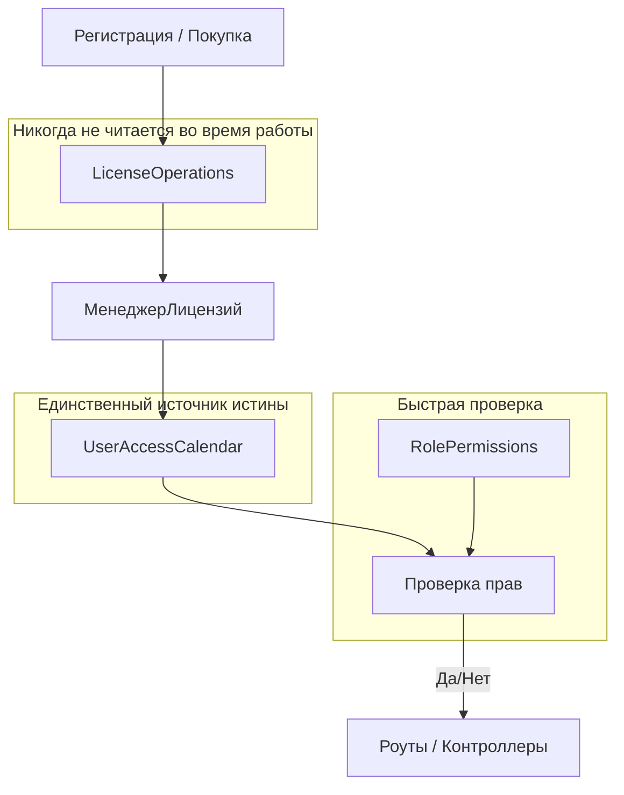
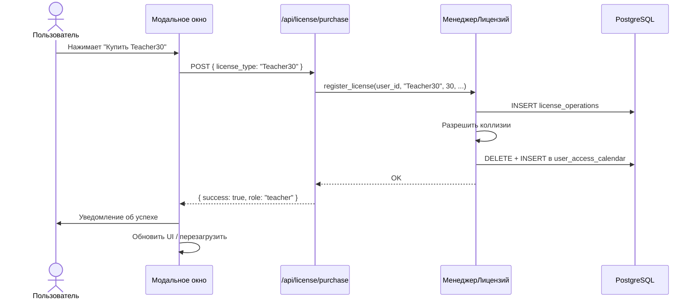
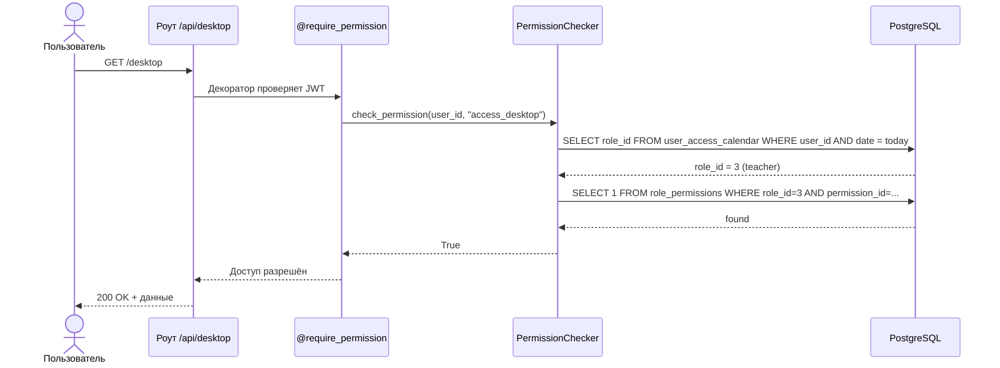

# План реализации системы ролей, лицензий и разрешений

## Исходное состояние

- Flask + PostgreSQL, JWT-аутентификация
- Таблица `users` уже имеет поле `role` (строка, по умолчанию `"user"`)
- Никакой системы проверки прав не существует
- Сайт — SPA на десктопе (`desktop.html`), модальные окна через JS

---

## Этап 1. Миграция БД — создание новых таблиц

Файл: [`migrations/add_roles_permissions_license_system.sql`](migrations/add_roles_permissions_license_system.sql)

### 1.1. Таблица `roles`
```sql
CREATE TABLE IF NOT EXISTS roles (
    id SERIAL PRIMARY KEY,
    code TEXT NOT NULL UNIQUE,
    name TEXT NOT NULL
);
```

Предзаполняемые роли: `guest`, `student`, `teacher`, `admin`.

### 1.2. Таблица `permissions`
```sql
CREATE TABLE IF NOT EXISTS permissions (
    id SERIAL PRIMARY KEY,
    code TEXT NOT NULL UNIQUE,
    name TEXT NOT NULL
);
```

Предзаполняемые разрешения:
- `available_characters_per_day` — Количество символов в день
- `audio_recordings_available_per_day` — Количество аудиозаписей в день
- `number_of_new_sentences_per_day` — Количество новых предложений в день
- `open_admin_report` — Открытие админ-отчёта
- `create_exercise` — Создание упражнений
- `delete_exercise` — Удаление упражнений
- `view_statistics` — Просмотр статистики
- `manage_students` — Управление студентами
- `create_dictation` — Создание диктанта
- `edit_dictation` — Редактирование диктанта
- `access_desktop` — Доступ к десктопу

### 1.3. Таблица `role_permissions`
```sql
CREATE TABLE IF NOT EXISTS role_permissions (
    role_id INTEGER NOT NULL REFERENCES roles(id) ON DELETE CASCADE,
    permission_id INTEGER NOT NULL REFERENCES permissions(id) ON DELETE CASCADE,
    number INTEGER,  -- -1 = безлимитно, NULL = просто bool-флаг, число = лимит
    PRIMARY KEY (role_id, permission_id)
);
```

### 1.4. Таблица `license_operations`
```sql
CREATE TABLE IF NOT EXISTS license_operations (
    id SERIAL PRIMARY KEY,
    user_id INTEGER NOT NULL REFERENCES users(id) ON DELETE CASCADE,
    document_type TEXT NOT NULL,    -- 'purchase', 'gift', 'promocode', 'manual', 'signup'
    document_id TEXT,               -- внешний идентификатор документа
    license_type TEXT NOT NULL,     -- 'Free', 'Teacher30', 'StudentTeacher30', 'Student30'
    date_begin DATE NOT NULL,
    days INTEGER NOT NULL,          -- 0 = навсегда
    priority INTEGER NOT NULL DEFAULT 0,
    comment TEXT,
    created_at TIMESTAMP NOT NULL DEFAULT CURRENT_TIMESTAMP
);
```

### 1.5. Таблица `user_access_calendar`
```sql
CREATE TABLE IF NOT EXISTS user_access_calendar (
    user_id INTEGER NOT NULL REFERENCES users(id) ON DELETE CASCADE,
    date DATE NOT NULL,
    role_id INTEGER NOT NULL REFERENCES roles(id) ON DELETE RESTRICT,
    source_document_type TEXT NOT NULL,
    source_document_id TEXT,
    created_at TIMESTAMP NOT NULL DEFAULT CURRENT_TIMESTAMP,
    PRIMARY KEY (user_id, date)
);
```

### 1.6. Добавление поля `role_id` в `users`
```sql
ALTER TABLE users ADD COLUMN IF NOT EXISTS role_id INTEGER REFERENCES roles(id);
```

---

## Этап 2. Сид-данные — предзаполнение справочников

Файл: [`helpers/db_license.py`](helpers/db_license.py) (функция `seed_roles_and_permissions()`)

При старте приложения или через отдельный скрипт заполняем:
- 4 роли
- ~11 разрешений
- Связи `role_permissions` с числовыми лимитами

Вызывается в [`app.py`](app.py) при инициализации.

---

## Этап 3. Менеджер лицензий

Файл: [`helpers/license_manager.py`](helpers/license_manager.py)

### 3.1. Класс `LicenseManager`

Единственная точка входа для изменения `user_access_calendar`.

Методы:
- `register_license(user_id, license_type, days, document_type, document_id, date_begin, comment)` — создаёт запись в `license_operations` и перестраивает календарь
- `rebuild_calendar_for_user(user_id, from_date, to_date)` — разрешает коллизии, приоритеты, пересечения и записывает в `user_access_calendar`
- `assign_free_license(user_id)` — выдаёт бесплатную лицензию при регистрации

### 3.2. Правила разрешения коллизий (MVP)

- Приоритет: `StudentTeacher30` > `Teacher30` > `Student30` > `Free`
- При пересечении периодов побеждает лицензия с более высоким приоритетом
- Если одинаковый приоритет — побеждает более поздняя
- `days=0` означает вечную лицензию

---

## Этап 4. Сервис проверки прав

Файл: [`helpers/permission_checker.py`](helpers/permission_checker.py)

### 4.1. Функция `check_permission(user_info, permission_code) -> bool`
Алгоритм:
1. По `user_id` + сегодняшняя дата → `user_access_calendar` → `role_id`
2. По `role_id` + `permission_code` → `role_permissions` → наличие записи
3. Вернуть `True`/`False`

### 4.2. Функция `get_permission_limit(user_info, permission_code) -> int | None`
Возвращает значение `number` из `role_permissions`:
- `-1` → безлимитно
- `None` → не задано (или bool-флаг)
- `число` → конкретный лимит

### 4.3. Flask-декоратор `@require_permission(permission_code)`
Оборачивает роут, проверяет JWT + право. При отсутствии → 403.

---

## Этап 5. Интеграция с существующей системой

### 5.1. Замена поля `role` на `role_id` в `users`
- Миграция: ALTER TABLE + перенос данных
- Обновление [`helpers/db_users.py`](helpers/db_users.py) — `role` → `role_id`
- Обновление [`routes/user_routes.py`](routes/user_routes.py) — все места, где используется `role`

### 5.2. Выдача Free-лицензии при регистрации
В [`routes/user_routes.py`](routes/user_routes.py), после `create_user()` → `LicenseManager.assign_free_license(user_id)`.

### 5.3. Добавление декораторов на существующие роуты
На ключевые эндпоинты (`/desktop`, редактор диктантов, статистика) добавляется `@require_permission`.

### 5.4. Фронтенд: скрытие недоступных элементов
При загрузке десктопа запрашиваем список прав пользователя → скрываем кнопки/панели без права доступа.

---

## Этап 6. Модальное окно покупки (заглушка)

### 6.1. HTML-шаблон
Файл: [`templates/partials/license_purchase_modal.html`](templates/partials/license_purchase_modal.html)

Содержимое:
- Заголовок: «Приобрести доступ»
- Карточки тарифов: Free, Teacher30, Student30, StudentTeacher30
- Кнопка «Купить» (заглушка — без реальной оплаты)
- Сообщение об успехе

### 6.2. CSS
Файл: [`static/css/license_purchase_modal.css`](static/css/license_purchase_modal.css)

### 6.3. JS-логика
Файл: [`static/js/license_purchase_modal.js`](static/js/license_purchase_modal.js)

- Открытие/закрытие модалки
- Отправка POST-запроса на `/api/license/purchase` с выбранным тарифом
- Обработка ответа, обновление UI

### 6.4. Бэкенд-роут
Файл: [`routes/license.py`](routes/license.py)

- `POST /api/license/purchase` — принимает `license_type`, вызывает `LicenseManager.register_license()` с `document_type='purchase'`
- `GET /api/license/status` — возвращает текущий статус пользователя (роль, лимиты)

### 6.5. Кнопка «Купить доступ» в интерфейсе
Добавляется в [`templates/desktop.html`](templates/desktop.html) в раздел `topbar` (рядом с меню пользователя).

---

## Этап 7. Админ-панель управления лицензиями

### 7.1. HTML-шаблон
Файл: [`templates/partials/admin_license_modal.html`](templates/partials/admin_license_modal.html)

Функции:
- Поиск пользователя по email
- Форма выдачи лицензии: выбор типа, дата начала, количество дней, комментарий
- Таблица истории лицензий пользователя
- Просмотр календаря доступа

### 7.2. JS-логика
Файл: [`static/js/admin_license_modal.js`](static/js/admin_license_modal.js)

### 7.3. Бэкенд-роуты
В [`routes/license.py`](routes/license.py):
- `POST /api/admin/license/grant` — ручная выдача лицензии (`document_type='manual'`)
- `GET /api/admin/license/history/<user_id>` — история операций
- `GET /api/admin/license/calendar/<user_id>` — календарь доступа

---

## Этап 8. Подключение модалки и финальная интеграция

- Регистрация модалки в [`templates/desktop.html`](templates/desktop.html)
- Подключение JS/CSS в [`templates/base.html`](templates/base.html)
- Проверка прав во всех существующих роутах (поэтапно, по приоритету):
  1. `/desktop` — доступ к десктопу
  2. `/editor/*` — редактор диктантов
  3. `/statistics/*` — статистика
  4. `/groups/*` — управление группами
- Обновление фронтенда: скрытие админ-кнопок при отсутствии прав

---

## Диаграмма архитектуры



## Диаграмма потока покупки лицензии



## Диаграмма проверки прав


